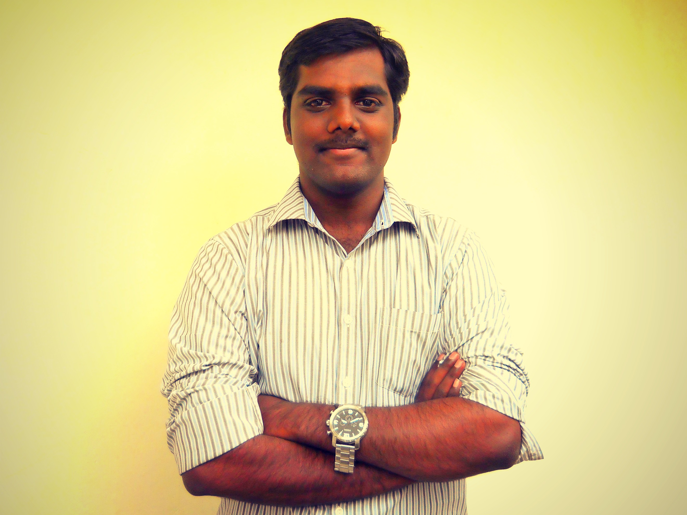

I am Sashiraj Chandrasekaran. 

I currently work at [MSD](https://merck.com) as a Senior Software Engineer.

I previously worked at [Nalagenetics Pte Ltd](https://nalagenetics.com) in multiple capacities. 
I started at Nalagenetics as the first software engineer to join the company and I 
built the initial versions of the web portals and mobile apps used by Nalagenetics 
for order/patient management in my position as Senior Software Engineer.
I was instrumental in building the procedures and processess used by the engineering team
and ensuring it was compliant with the regulatory standards (ISO13485 / ISO27001 / IEC62304) 
adopted by the company. I raised the engineering and IT teams from scratch and served as the team lead for 
both teams until the company secured Series A funding.

I previously worked as a Backend web developer at [JiL Creation Pte Ltd](https://www.sgpbusiness.com/company/Jil-Creation-Pte-Ltd). At Jil Creation, 
I worked on multiple projects for different clients to build, API platforms 
for software, among other things a job matching application, a OTT platform, 
a MICE mobile app and an AR mobile app.

I am passionate about bringing people together to build software that helps 
to make people's life easier. I also enjoy playing with data and tinkering 
with Machine Learning.

### Professional Experience

#### Senior Software Engineer, MSD International Gmbh
##### May 2022 - Present
* Building APIs used by internal and externa clients.

#### Information Team Lead, Nalagenetics Pte Ltd, 
##### July 2021 - May 2022
* Led the company through a successful ISO27001 (Information Security Management System) audit. Served as the Information Security Management Representative (ISMR).
* Rolled-out of a new ITSM system to keep track of requests coming from different departments for access to IT resources. 
* Decreased the cloud security alerts by 70%.
* Ensured 100% migration of all departments in the company from Slack to Microsoft Teams. 

#### Engineering Team Lead, Nalagenetics Pte Ltd, 
##### January 2021 - May 2022
* Implemented ISO13485/IEC62304 (Quality Management System) and established procedures and practices for secure software development for the SaMD (Software as a Medical Device). Led the Engineering team through 3 successful QMS audits.
* Led a team of 10 engineers across backend, frontend and mobile applications to build and deliver quality software within the agreed timelines.
* Mentored interns and junior engineers to share knowledge within the team. Organised regular hangout sessions to share knowledge internally and improve team bonding.

#### Senior Software Engineer, Nalagenetics Pte Ltd, 
##### November 2018 - December 2020
* Designed and developed APIs as well as front-end interfaces using NodeJS (Express) and Angular.
* Refactored the code-base to improve the report generation capabilities. Moved to an event-driven queue system and serverless functions to support a higher volume of report generation.
* Worked closely with product and BD departments to understand user requirements and implement features as needed.

#### Backend Developer, JiL Creation Pte Ltd/ iCON, 
##### November 2016 - November 2018
* Designed backend web applications and APIs on NodeJS (Express and Loopback frameworks)
* Managed Cloud Infrastructure on AWS and Azure (depending on client preferences)
* Interacted with clients to gather requirements and translate to user stories
* Planned system architecture and software implementation
* Designed database structures for both SQL and NoSQL databases
* Handled deployments and release for all backend systems
* Developed data analytics pages for campaign monitoring

### Publication
* **Chandrasekaran, S.**, & Song, I. (2016). Sustainability of Big Data Servers under Rapid Changes of
Technology. Lecture Notes in Electrical Engineering Information Science and Applications (ICISA)
2016, 376, 149-15945  [Paper](https://link.springer.com/chapter/10.1007/978-981-10-0557-2_15)

* [country-code-switch] (https://www.npmjs.com/package/country-code-switch) a nifty package to switch the ISO formats for different countries. Downloaded 7k times as of May 2022.

### Education
* Bachelor of Engineering, Electrical and Electronics Engineering, Visvesvaraya Tech University, India, 2013
* Master of Information Technology, James Cook University, Singapore, 2016

### Extras
* I completed a Udacity Nanodegree in Data Analytics. Data never lies! ;)
* I am a fan of history and love travelling.
* I have a keen interest in macro photography.